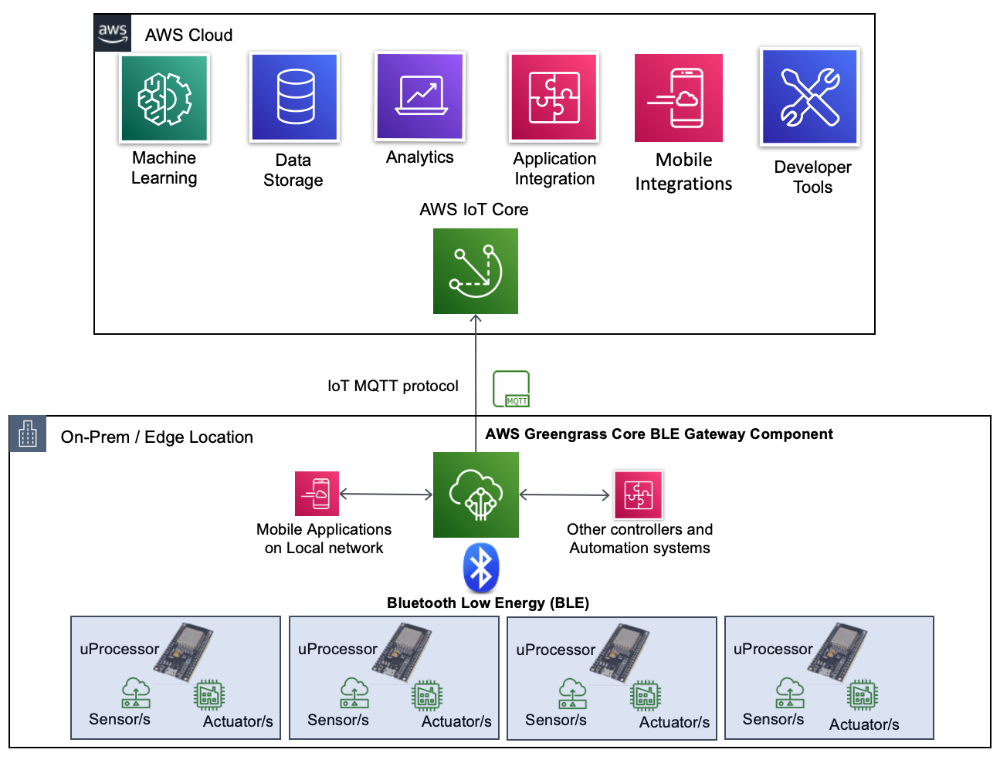
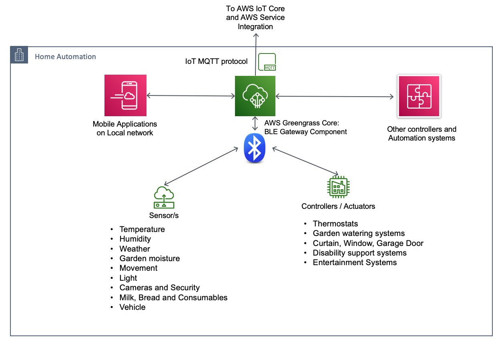
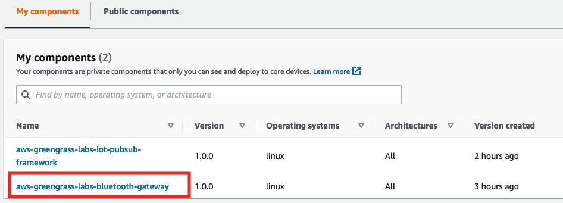
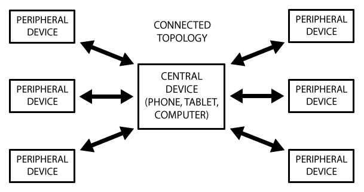

# AWS Greengrass Bluetooth (BLE) IoT Gateway

## Introduction

Bluetooth and Bluetooth Low Energy (BLE) devices are ubiquitous in our daily lives managing 
connectivity across smart home automation, retail, entertainment, health and automotive devices. 
Being comparatively short range (up to 100m), BLE devices are expected to connect (or pair) with 
a central controller such as mobiles or tablets to process information and act as a gateway to 
applications and other services.  

The AWS Greengrass Bluetooth Gateway component extends BLE communications within the local environment 
securely across the Internet to the AWS cloud. This provides Over-the-Internet control and integration of local 
BLE devices to AWS hosted ML, data, analytics and application services. 



## Motivation

The Bluetooth / BLE protocol is well defined and widely supported by IoT device and chip manufactures. 
Many low-cost micro-processors and System on Chip (SoC) devices that power everything from our home 
air-conditioners to our cars entertainment systems rely on Bluetooth / BLE as the primary communications channel. 
Providing a simple AWS cloud gateway for the BLE protocol allows product and service developers 
the ability to include mobile and Internet based remote control, logging and advanced data and analytics 
services on existing and future IoT applications. 

## Example Use-Cases

Because of the localized nature and cost of cabling (especially retro-fitting) for Smart Home automation, 
this industry is particularly well suited to the AWS Greengrass BLE Gateway. 
For example, a central automation device managed by AWS Greengrass communication with a variety of 
home sensors and actuators. 



## AWS Greengrass BLE Gateway Technical Overview

The AWS Greengrass BLE Gateway component is developed in Python and uses the 
[BluePy](https://ianharvey.github.io/bluepy-doc/index.html) library to create the BLE client interface. 
BluePy is a Python module which allows communication with Bluetooth Low Energy devices. 
The current implementation runs on Linux (internally it uses code from the [BlueZ project](http://www.bluez.org/)), 
although it can be ported to other platforms.  

The AWS Greengrass BLE Gateway component should be deployed on a Linux based AWS Greengrass Core wih supported BLE hardware located within range of the Bluetooth Low Energy peripheral devices. Once connected, the AWS Greengrass BLE Gateway component provides a **CONTROL** channel for device state management and a **DATA** channel for sending and receiving messages to the BLE Devices via the Greengrass core. By default, BLE messages are proxied to both MQTT and IPC to support communications with applications and services in the AWS core as well as other Greengrass 
components on the same device.   


### AWS Greengrass BLE Gateway Component Control Functions

Control functions on the AWS Greengrass BLE Gateway component include:

* **Connect:** Request BLE Gateway to connect / pair with a given BLE MAC address,
* **Disconnect:** Request BLE Gateway to disconnect from a given BLE MAC address,
* **List:** Return the connection state of BLE MACs that have had a connect request and 
* **Scan:** Scan the BLE Devices in range and return details of supported Advertised Data Types and description.

Control functions are triggered by messages sent to the specific control topics on the AWS Greengrass 
BLE Gateway component. The below simplified diagram provides an example of a BLE Device connect 
request. Control messages are supported over MQTT from the AWS IoT Core and IPC from other 
local Greengrass components.   


**Base Control Topic:** aws-greengrass/things/THING_NAME/ble/control/  
**Error Response Topic:** aws-greengrass/things/THING_NAME/ble/error/  

#### BLE Device Connect:  

Requests the AWS Greengrass BLE Gateway attempt to pair with BLE device with the given MAC address. 
The AWS Greengrass BLE Gateway maintains state of all requested connections and if a device connection 
fails it will re-attempt to pair again until a disconnect request is received.  

The connected devices list does not survive a Greengrass device reboot. Future iterations will 
write this to a local shadow instead but in this initial release, you must monitor BLE device connection state.

**Note:** If the device doesn’t exist, it will continue to try for up to 30 seconds before returning a failed connection. 
If the delay causes a problem for application logic then perform a scan first to ensure the device exists and is reachable.  

**Connect Request Topic:** aws-greengrass/things/**THING_NAME**/ble/control/connect  
**Connect Response Topic:** aws-greengrass/things/**THING_NAME**/ble/control/connect/response  

**Message Format:**  
```
{ 
    "ble-mac" : "XX:XX:XX:XX:XX:XX"
}
```

**Sample Responses:**  
```
{
    "status": 200,
    "data": {
        "ble-mac": "XX:XX:XX:XX:XX:XX",
        "connect-status": "success"
    }
}
```

**BLE Device Disconnect:**  

The BLE Device disconnect command instructs the AWS Greengrass BLE Gateway to terminate 
the BLE connection if active and remove the BLE Device MAC from the locally maintained connected devices list.  

**Connect Request Topic:** aws-greengrass/things/**THING_NAME**/ble/control/disconnect  
**Connect Response Topic:** aws-greengrass/things/**THING_NAME**/ble/control/disconnect/response  

**Message Format:**  
```
{ 
    "ble-mac" : "XX:XX:XX:XX:XX:XX"
}
```

**Sample Response:**  
```
{
    "status": 200,
    "data": {
        "ble-mac": "XX:XX:XX:XX:XX:XX",
        "disconnect-status": "success"
    }
}
```

**BLE Device List:**   
The BLE Device list command returns the connection state of all devices in the connected device list. 
That is, all BLE devices that have received a connect command and not a subsequent disconnect command. 
Don’t confuse this with the Scan function. List will only provide information on devices that 
have had a connection request, scan will return information on all devices within range of the BLE gateway.  

**Connect Request Topic:** aws-greengrass/things/**THING_NAME**/ble/control/list  
**Connect Response Topic:** aws-greengrass/things/**THING_NAME**/ble/control/list/response  

**Message:**
```
{ } # Empty message object, no specific data required here.  
```

**Sample Response:**
```
{
    "status": 200,
    "data": {
        "3C:61:05:12:EE:0A": {
        "connection-state": "conn",
        "addr-type": "public"
        }
    }
}
```

**BLE Device Scan:**  

The BLE Device scan returns details of all BLE devices within range of the AWS Greengrass BLE Gateway. 
By default, the scan is set for 5 seconds and so the response will take at least that long. 

BLE devices can advertise a number of supported data types including a description (BLE Ad-Type: 255) and 
the BLE Complete Local Name (BLE Ad-Type: 9). In the ESP32 micro-python code sample provided, both of these are 
set to **BLE_Device**. You can use these fields in your BLE devices to set a unique name that will 
identify associated devices as needed.   

**Connect Request Topic:** aws-greengrass/things/**THING_NAME**/ble/control/scan  
**Connect Response Topic:** aws-greengrass/things/**THING_NAME**/ble/control/scan/response  

**Message Format:**  
```
{ } # Empty message object, no specific data required here.
```

**Sample Response:**  
```
{
  "3c:61:05:12:ee:0a": {
    "address-type": "public",
    "rssi-db": -22,
    "ad-data-types": {
      "1": {
        "adtype-value": "06",
        "descption": "Flags"
      },
      "9": {
        "adtype-value": "BLE_Device",
        "descption": "Complete Local Name"
      },
      "25": {
        "adtype-value": "8000",
        "descption": "Appearance"
      },
      "255": {
        "adtype-value": "BLE_Device",
        "descption": "Manufacturer"
      }
    }
  },
.....
```

### BLE Device Errors

The BLE component will report errors to the BLE Error topic: **aws-greengrass/things/THING_NAME/ble/error**
These are internal server type errors where an unexpected event occurred. Errors such as a BLE device failing to connect will report back to their respective response topics.
The example below is in response to sending a message ```{'unsupported': 'command'}``` to the connect topic that only expects the 'ble-mac' field. 

```
{
  "status": 500,
  "error-message": "BLE CONTROL ROUTING KEY_ERROR: 'ble-mac' - TOPIC aws-greengrass/things/ble-gateway-3B/ble/control/connect - MESSAGE_OBJECT: {'unsupported': 'command'}"
}
```

We recommend any testing or consuming applications subscribe to and monitor this error topic for unexpected events.

### AWS Greengrass BLE Gateway Component Data Functions

Data is proxied between BLE Devices and MQTT / IPC PubSub message bus via the AWS Greengrass BLE Gateway 
component by dedicated topics for each device. When a BLE device successfully connects to the 
AWS Greengrass BLE Gateway, it automatically subscribes to the devices *TX Data* topic and forwards 
any messages received on this topic to the BLE Device. Similarly, any message received on the AWS 
Greengrass BLE Gateway from the BLE device is re-published to the devices *RX Data* PubSub topic.  

**BLE Device TX Data Topic:** aws-greengrass/things/**THING_NAME**/ble/data/tx/**XX:XX:XX:XX:XX:XX**  
**BLE Device RX Data Topic:** aws-greengrass/things/**THING_NAME**/ble/data/rx/**XX:XX:XX:XX:XX:XX**  

**Where:**  
**THING_NAME:** Is the AWS Greengrass Core IoT Thing name and   
**XX:XX:XX:XX:XX:XX** is the specific BLE Device MAC

Simply put, TX/RX directions are taken from the cloud perspective where transmit is cloud 
(or other component) to BLE Device and RX is BLE Device to Cloud (or other component).  


#### AWS Greengrass BLE Gateway Message Format

The AWS Greengrass BLE Gateway uses the described systems of PubSub topics to enforce control and data 
transfer to avoid the need for any specific control fields in the message payload. This means there is 
no specific restrictions or controls on the message structure deployed between the BLE device and the AWS 
IoT core or other AWS Greengrass components. This only requirement is that messages must be in valid 
JSON format, for binary or blob data it is recommend to convert to base-64 and transmit as a JSON field.   

## Deploying the AWS Greengrass Bluetooth Gateway Component

### Prerequisites
* An AWS Account with required permissions, see [How to Create a new AWS account](https://aws.amazon.com/premiumsupport/knowledge-center/create-and-activate-aws-account/) if needed.
* A registered [AWS Greengrass V2 core device](https://docs.aws.amazon.com/greengrass/v2/developerguide/setting-up.html)
* Knowledge of [AWS Greengrass Components](https://docs.aws.amazon.com/greengrass/v2/developerguide/create-components.html) and the [AWS Greengrass Developer Guide](https://docs.aws.amazon.com/greengrass/v2/developerguide).
* AWS Greengrass Development Kit installed.

### Device Dependancies:

Ensure the Greengrass core device has Python3, python3-pip and python3-venv installed.

i.e: To install on Debian based distributions:  
sudo apt-get -y install python3-pip  
sudo apt-get install python3-venv  

### Clone the AWS Greengrass Bluetooth Gateway Component

```
# Clone this GIT Repository
git clone https://github.com/awslabs/aws-greengrass-labs-bluetooth-gateway.git
```

### Publish the AWS Greengrass Bluetooth Gateway Component

In this guide, we will deploy the AWS Greengrass Bluetooth Gateway Component to AWS IoT Core using the AWS IoT Greengrass Development Kit (GDK). The AWS GDK is a simple command line tool to build and publish Greengrass components to the AWS IoT core. It can be downloaded and installed from the [aws-greengrass-gdk-cli](https://github.com/aws-greengrass/aws-greengrass-gdk-cli) repository. More information can be found in the [AWS IoT Greengrass Development Kit](https://docs.aws.amazon.com/greengrass/v2/developerguide/greengrass-development-kit-cli.html) section of the Iot Greengrass developers guide.   


* Update the AWS GDK config file. Open the src/gdk-config.json config file and update the below fields accordingly
```
{
    "component" :{
      "aws-greengrass-labs-bluetooth-gateway": {  # << Component name
        "author": "Amazon",
        "version": "NEXT_PATCH",
        "build": {
          "build_system" :"zip"
        },
        "publish": {
          "bucket": "[S3_BUCKET_NAME]",    # << A new S3 bucket will be created starting with this name. 
          "region": "[AWS_REGION]"         # << The region your Greengrass core is registered.
        }
      }
    },
    "gdk_version": "1.0.0"
  }
```

* To build and publish the AWS Greengrass Bluetooth Gateway Component to AWS IoT Core:
```
# CD into the locally cloned component src directory
cd aws-greengrass-labs-bluetooth-gateway/src

# Build the component:
gdk component build -d

# The above will create a greengrass-build and a zip-build directory with all of the 
# files need to publish the component to the AWS Core.

# Publish the component to AWS Core:
gdk component publish -d

```

The AWS Greengrass Bluetooth Gateway Component will now be published to the AWS IoT Core. You can verify in the [AWS IoT Console](https://console.aws.amazon.com/iot/) by going to the **Components** section under the **Greengrass** menu as shown below:



### Deploying the AWS Greengrass Bluetooth Gateway Component to an AWS Core

The final step is to deploy the component to a registered AWS Greengrass Core:
* In the [AWS IoT Console](https://console.aws.amazon.com/iot/) go to **Greengrass >> Core devices** menu item and click on the Greengrass core to deploy too.

* Select the **Deployments** tab and click on the managed deployment to add this component too.
* Click **Revise**, **Next** then select the **aws-greengrass-labs-bluetooth-gateway** component
* Click next leaving all fields default until the final page then click **Deploy**

### Monitoring and Debugging the Component Deployment

If there are any issues, you can monitor the deployment on the Greengrass core in the following logs:
* **Greengrass Core Log:** /greengrass/v2/greengrass.log and 
* **Greengrass Component Log:** /greengrass/v2/aws-greengrass-labs-bluetooth-gateway.log

### Validate the AWS Greengrass Bluetooth Gateway Component

Assuming the AWS Greengrass Bluetooth Gateway Component has been successfully deployed to a registered AWS Greengrass device it will be listening for commands on the respective control topics: 
* aws-greengrass/things/**THING_NAME**/ble/control/connect
* aws-greengrass/things/**THING_NAME**/ble/control/disconnect
* aws-greengrass/things/**THING_NAME**/ble/control/list
* aws-greengrass/things/**THING_NAME**/ble/control/scan

In the AWS Console MQTT Test page, subscribe to: aws-greengrass/things/**THING_NAME**/ble/control/#  
This will receive any control commands from the AWS Greengrass Bluetooth Gateway.

If at this stage, if you don't have any suitable BLE devices to connect to, you can still run a **scan** and **list** operation to validate the functionality.

* **BLE Scan**: Publish an empty object '{}' to: aws-greengrass/things/**THING_NAME**/ble/control/scan  
After a 5 second scan, expect a response listing all of the advertising BLE devices withing range of the Greengrass BLE Gateway. 

* **BLE List**: Publish an empty object '{}' to: aws-greengrass/things/**THING_NAME**/ble/control/list  
Expect to receive an empty connected device list. 

For connect and data operations, you need to connect to a valid BLE Peripheral Devices device. An example of this is shown in the following sections. 

## BLE Peripheral Devices

To date, the AWS Greengrass BLE Gateway has been tested using the ESP32 WROOM developmeesp-32nt board 
running Micro-python. Sample micro-python for the ESP32 has been provided in this repository with sample 
data commands that return various information or actions on the BLE device.  


Micropython has native support for BLE on the ESP32 and provides a relatively simple means of deploying this interface. 

The ESP32 was selected for initial development as the BLE peripheral as it is low cost, supports BLE4.x / 5 
and classic Bluetooth and has good support for an array of actuators and sensors through 
GPIO, DAC / ADC, I2C, SPI and other serial interfaces. 

### Deploy the ESP32 uPython Code Sample

* On an ESP32 (or comparable device) [Install Micro-Python](https://docs.micropython.org/en/latest/esp32/tutorial/intro.html)
* Using your preferred serial control tool, copy the contents of the [esp32-ble-device](esp32-ble-device) into the ESP32 and boot.

Once installed, the ESP32 will advertise itself over Bluetooth using **BLE_Device** as the local name that will be visible from BLE Scans. 
Once connect, the ESP32 will respond to the following commands proxied via the AWS Greengrass BLE Gateway to the BLE interface of the ESP32. 

## Validate the AWS Greengrass Bluetooth Gateway and ESP32 uPython Code Sample

To validate, submit a SCAN as described above. You should expect to see a BLE device with the "adtype-value": "BLE_Device". This is the advertised type field that’s populated by the ESP32 sample code. 

Example:
```
  "3c:61:05:12:ee:0a": {
    "address-type": "public",
    "rssi-db": -23,
    "ad-data-types": {
      "1": {
        "adtype-value": "06",
        "descption": "Flags"
      },
      "9": {
        "adtype-value": "BLE_Device",
        "descption": "Complete Local Name"
      },
      "25": {
        "adtype-value": "8000",
        "descption": "Appearance"
      },
      "255": {
        "adtype-value": "BLE_Device",
        "descption": "Manufacturer"
      }
    }
  },
  ```

Record the Mac address of this device and send a connect command as described above. And finally, you will be able to send the following commands to the BLE Peripheral and get a valid response on the IoT Things BLE Data topics.  

**Note:** More detail of the data commands are avaliable in [BLE-Test-Messages](/ble-test-messages.txt)

**Publish Topic:** aws-greengrass/things/**THING_NAME**/ble/data/tx/**BLE_DEVICE_MAC**  
**Response Topic:** aws-greengrass/things/**THING_NAME**/ble/data/rx/list/**BLE_DEVICE_MAC**

1. Request Describe BLE Device message:  
```
 {
  "command" : "describe-ble-device"
 }
  ```

 Response:  
 ```
{
  "data": {
    "uname": "\"(sysname='esp32', nodename='esp32', release='1.16.0', version='v1.16 on 2021-06-23', machine='ESP32 module with ESP32')\""
  },
  "status": 200
}
```

2. Toggle LED:  
```
{
  "command" : "toggle_led"
}
```

Response:  
```
{
  "data": {
    "message": "ESP32 BLE LED Set to: 1"
  },
  "status": 200
}
```

3. Request BLE Device Processor Board Temperature
```
{
  "command" : "get-processor-board-temp"
}
```

Response:  
```
{
  "data": {
    "board_temp_fahrenheit": 126,
    "board_temp_celsius": 52.22
  },
  "status": 200
}
```

4. Request a HW reset of the BLE devices.
```
{
  "command" : "hw-reset-micro"
}
```
Response:  
None, processor will do a hardware reset and silently  return to operation.  

## Known Limitations and Prickly Edges:

* BLE Message MTU: 512bytes - Limitation of the ESP32 Board and lack of BLE L2CAP support in MicroPython.
* BLE message buffer causes exception if multiple messages read/write simultaneously. Can mitigate by requesting message ACK as per BLE standard but still found can error in some cases.
* Central Greengrass component developed using BluePy which out of the box only supports Linux so limitation on architectures the Greengrass BLE Gateway component can be deployed.  
* Micro-Python for Peripheral - no RTOS or embedded support as yet but FreeRTOS has Nordic UART support that should integrate with some additional qualification.
* BLE peripheral are not connected as IoT things to AWS Cloud or Greengrass device, and therefore:
    * No native support for OTA updates of peripheral devices over BLE. 
    * No certificate-based authentication of peripheral, just of central controller which acts as a proxy. There are ways to prevent unauthorized BLE connections to the central device. 

## Appendix A

This appendix provides more detail of the Bluetooth / BLE protocols and standards. 

Bluetooth Low Energy (v4.x / 5)  GAP and GATT

Advancements in the Bluetooth protocol and in particular BLE 4.x / 5.0  with the introduction of the 
BLE Generic Access Profile (GAP) and Generic Attribute Profile (GATT)  allows Bluetooth Low Energy 
devices to operate in a client / server relationship. This provides a means for BLE devices to 
discover each other and advertise generic service capabilities. 

[Source1: introduction-to-bluetooth-low-energy](https://learn.adafruit.com/introduction-to-bluetooth-low-energy)  
[Source2: ble-master-slave-gatt-client-server-and-data-rx-tx-basics](https://community.silabs.com/s/article/ble-master-slave-gatt-client-server-and-data-rx-tx-basics?language=en_US)

#### Generic Access Profile (GAP)

GAP is an acronym for the **Generic Access Profile**, it controls connections and advertising in Bluetooth. 
GAP is what makes your BLE device visible to the outside world, and determines how two devices can (or can't) 
interact with each other. The fields supported by the GAP protocol to describe a device connections is 
shown in the [GAP Bluetooth Standard](https://btprodspecificationrefs.blob.core.windows.net/assigned-numbers/Assigned%20Number%20Types/Generic%20Access%20Profile.pdf).

The GAP standard defines **Central** and **Peripheral** device roles:

* **Peripheral** devices are small, low power, resource constrained devices that can connect to a much more powerful 
central device. Peripheral devices are things like a heart rate monitor and BLE enabled proximity tag, etc.
* **Central** devices are usually the mobile phone or tablet that you connect to with far more processing power and memory.



In the AWS Greengrass BLE Gateway use-case, the GAP **Peripheral** is expected to be a generic uProcessor with BLE 
support such as the ESP32 that controls actuators and has sensor data available for the various supported inputs. 
The **Central** device is the AWS Greengrass Core with the AWS Greengrass BLE Gateway component installed.  

#### Generic Attribute Profile (GATT)

GATT is an acronym for the Generic Attribute Profile, it defines the way that two Bluetooth Low Energy devices transfer 
data using concepts called **Services** and **Characteristics**. It makes use of a generic data protocol called the 
**Attribute Protocol (ATT)**, which is used to store services, characteristics and related data in a simple lookup table using 16-bit IDs.  

GATT services and characteristics are negotiated once a connection is established between two devices, 
meaning that you have already gone through the advertising process governed by GAP. A BLE peripheral can 
only be connected to one central device at a time. As soon as a peripheral connects to a central device, 
it will stop advertising itself and other devices.  

**GATT Client /Server Functionality**

Another important concept in a BLE design is the difference between a **GATT server** and a **GATT client**. 
These roles are not mutually exclusive, though typically your device will only be one or the other.  

* **GATT client** - a device which accesses data on the remote GATT server via read, write, notify, or indicate operations.
* **GATT server** - a device which stores data locally and provides data access methods to a remote GATT client.

Perhaps it is counter-intuitive but in BLE, the **GAP Peripheral device** advertises itself to initiate the 
connection and is therefore considered as the Server whereas the **Central** device scans for connections 
and is considered as the client in this relationship. This however, this is only to dictate the service and 
characteristic negotiation. Once complete, both the server and client can initiate asynchronous data transmission through different means.  

**GATT Services and Characteristics:**

GATT transactions in BLE are based on high-level, nested objects called **Profiles**, **Services** and **Characteristics.**


* **Profile:** A Profile is simple a predefined collection of services that has been compiled by either the Bluetooth 
SIG or by the peripheral designers. The Heart Rate Profile, for example, combines the Heart Rate Service and the Device 
Information Service. The complete list of officially adopted GATT-based profiles can be seen at the 
[Profiles Overview](https://www.bluetooth.com/specifications/gatt).  
* **Service:** Services are used to break data up into logical entities, and contain specific chunks of data called 
characteristics. A service can have one or more characteristics, and each service distinguishes itself from other services 
by means of a unique numeric ID. A full list of officially adopted BLE services can be seen on the 
[Services](https://www.bluetooth.com/specifications/gatt/services) page of the Bluetooth Developer Portal.
* **Characteristics:** The lowest level concept in GATT transactions is the characteristic, which encapsulates a single data point.   

Characteristics (data points) are defined as read, write or notify. GATT client devices can read or write to a characteristic 
and GATT servers can read or use the notify function to initiate asynchronous data transmission to client devices.

### The Challenge

Bluetooth has traditionally paired devices such as a heart-rate monitors or wireless ear-phones with a specific central 
device such as a mobile phone or tablet with clear distinctions of HW, application data types and flow (directions). 
This level of specificity in connection patterns doesn’t lend itself well to generalized Bluetooth gateways. Because of this, 
designers haven't traditionally viewed Bluetooth as a means of connecting disparate IoT device types with unspecified upstream services.  

#### Highly Defined Service Definitions in a Generic Gateway Application

In BLE GAP/GATT connections, the server (peripheral) devices initiate a connection with the client (central device) to negotiate 
the supported services and the read, write and notify characteristics that can be used for communications on the given channel. 
In common BLE use cases, the hardware of the peripheral device (A heart rate monitor for example) and the central device (a mobile or tablet) 
is well defined and the software on both sides is developed specifically with a given use case in mind. More importantly, the data points 
(characteristics) and directional flow (read, write or notify) are determined by the use case itself.   

One similar AWS solution to communicate between IOT over MQTT with local mobile (iOS / Android) applications is shown here in the 
[Amazon FreeRTOS BLE](https://aws.amazon.com/blogs/iot/aws-announces-bluetooth-low-energy-support-in-amazon-freertos-as-generally-available/) blog. 
This solution shows the dependency that developers have had to interface BLE devices with mobile devices and applications as the gateway. 

In the Heart Rate monitor example, it’s unlikely the central device needs to negotiate a write characteristic as data flow is 
uni-directional from the monitor (peripheral) to the central device (tablet). In this way, the use case has determined and 
bounded the characteristics that both the BLE server and client need to support. Furthermore, standards are defined for 
known BLE services such as the [Heart Rate Service](https://www.bluetooth.com/specifications/specs/heart-rate-service-1-0/) 
that allows BLE clients and servers from different vendors or developers to interoperate.   

If developing a generic BLE Gateway, the GAP protocol needs a means of identifying peripheral devices as interesting for the a 
given central application so it accepts the connection as well as the GATT service and characteristics that will support any 
number of data types and flows.   

**Nordic UART Service:**

One such solution is the [BLE Nordic UART Service (NUS)](https://developer.nordicsemi.com/nRF_Connect_SDK/doc/latest/nrf/include/bluetooth/services/nus.html#nus-service-readme) 
which provides defined BLE characteristics for a Universal Asynchronous Receiver / Transmitter (UART) over the BLE protocol. 
By developing a software based solution using GAP to define client and server roles and the Nordic UART Service GATT identifiers to 
specify and advertise Read, Write and Notify BLE characteristics, we can provide a simple BLE interface between any set of gateway 
and peripheral devices that support the BLE protocol.  

By deferring to generic UART communication channel, the system itself doesn’t enforce any specific BLE characteristics on the developer 
that may limit the HW or application types supported and makes possible the concept of a generic BLE central client on AWS Greengrass.  

**Note:** The Nordic UART Service (NUS) is a full (and proprietary) BLE protocol stack. In its first iteration, this project doesn’t intend to be fully 
NUS compliant and only uses the concept of BLE UART communications and the well-known NUS service ID and follows the 
NUS recommendations on read, write and notify characteristics.
